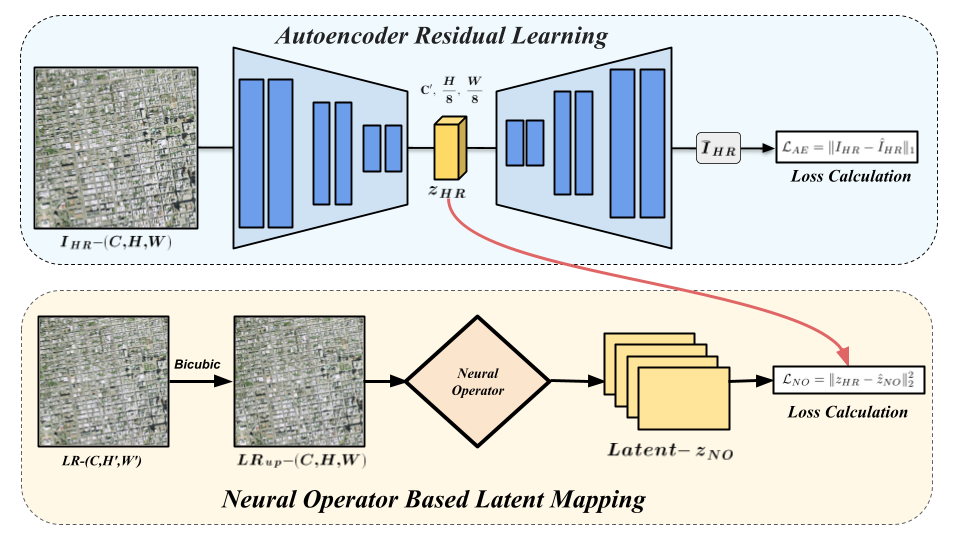
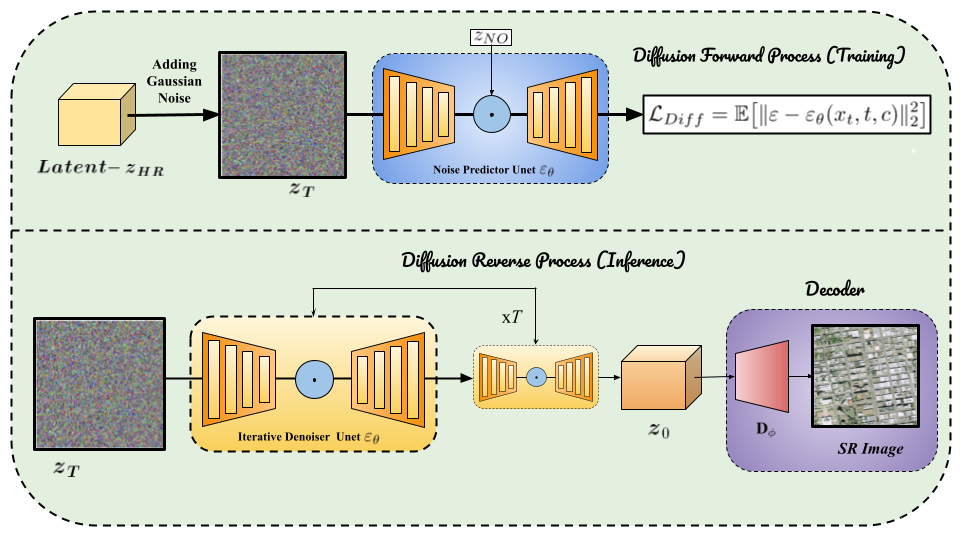
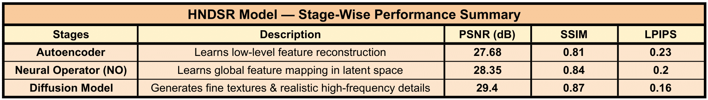
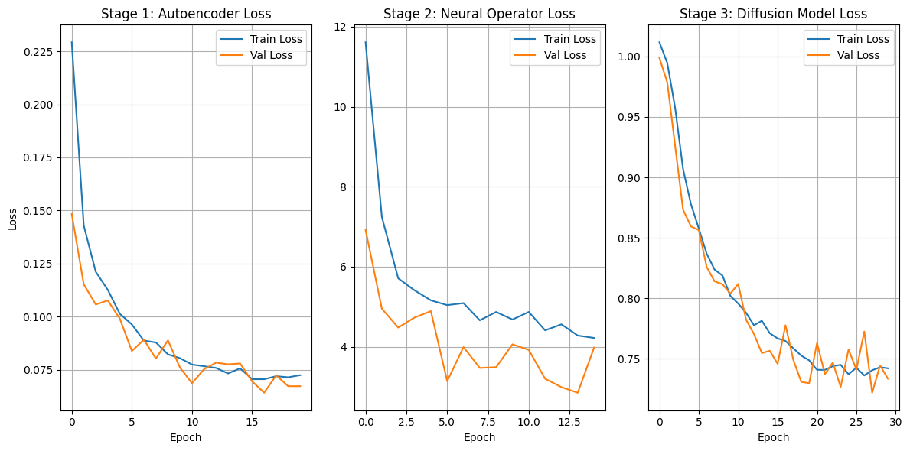

# HNDSR: A Hybrid Neural Operator–Diffusion Model for Continuous-Scale Satellite Image Super-Resolution

[](https://opensource.org/licenses/MIT)
[](https://www.python.org/downloads/)
[](https://pytorch.org/)

> **⚠️ Note:** This is an unpublished academic mini-project conducted as part of the 5th Semester coursework at IIIT Nagpur (July-December 2025). The research has not yet been peer-reviewed or published in any conference or journal.

**Authors:** Adil Khan, Rakshit Modanwal, Harsh Vardhan, Piyush Jain, Yash Vikram  
**Institution:** Indian Institute of Information Technology, Nagpur  
**Department:** Computer Science and Engineering

---

## 📋 Overview

HNDSR is a novel hybrid super-resolution framework that combines the continuous-scale capabilities of Neural Operators with the high-fidelity texture generation of Diffusion Models. This approach addresses key challenges in satellite image super-resolution by enabling flexible, non-integer upscaling while maintaining exceptional perceptual quality.

### Key Features

- **Continuous-Scale Super-Resolution**: Support for arbitrary scaling factors (1× to 6×), not limited to integer multiples
- **Hybrid Architecture**: Combines Neural Operator priors with Latent Diffusion refinement
- **Three-Stage Pipeline**:
  - **Stage 1**: Autoencoder for structural feature learning
  - **Stage 2**: Neural Operator for continuous latent mapping
  - **Stage 3**: Diffusion Model for high-frequency detail refinement
- **Superior Performance**: Achieves state-of-the-art PSNR (29.40 dB), SSIM (0.87), and LPIPS (0.16) on 4× upscaling

### Architecture


*Three-stage hybrid architecture combining Autoencoder, Neural Operator, and Diffusion Model*

---

## 🚀 Quick Start

### Prerequisites

- Python 3.8 or higher
- CUDA-capable GPU (recommended: 16GB+ VRAM)
- 20GB+ free disk space for dataset

### Installation

1. **Clone the repository**
```bash
git clone https://github.com/The-Harsh-Vardhan/HNDSR.git
cd HNDSR
```

2. **Create a virtual environment**
```bash
python -m venv venv
source venv/bin/activate  # On Windows: venv\Scripts\activate
```

3. **Install dependencies**
```bash
pip install -r requirements.txt
```

---

## 📊 Dataset Setup

This project uses the **4× Satellite Image Super-Resolution** dataset from Kaggle.

### Option 1: Using KaggleHub (Recommended)

```python
import kagglehub
dataset_path = kagglehub.dataset_download("cristobaltudela/4x-satellite-image-super-resolution")
```

### Option 2: Manual Download

1. Download from [4× Satellite Image Super-Resolution Dataset](https://www.kaggle.com/datasets/cristobaltudela/4x-satellite-image-super-resolution)
2. Extract to your preferred directory
3. Update the dataset path in the notebook configuration

### Dataset Structure

```
4x-satellite-image-super-resolution/
├── HR_0.5m/          # High-resolution images (0.5m/pixel)
└── LR_2m/            # Low-resolution images (2m/pixel)
```

---

## 🔧 Usage

### Training

Open and run the Jupyter notebook:

```bash
jupyter notebook HNDSR.ipynb
```

The notebook contains three sequential training stages:

1. **Stage 1: Autoencoder Training** (~20 epochs)
   - Learns low-level structural features
   - L1 reconstruction loss

2. **Stage 2: Neural Operator Training** (~15 epochs)
   - Learns continuous latent mappings
   - MSE loss on latent representations

3. **Stage 3: Diffusion Model Training** (~30 epochs)
   - Refines high-frequency details
   - Denoising diffusion loss

**Training Tips:**
- Start with Stage 1, then proceed sequentially
- Checkpoints are auto-saved in `checkpoints/` directory
- Monitor GPU memory usage (adjust batch size if needed)
- Expected total training time: ~48-72 hours on RTX 3090

### Inference

```python
# Load trained models
autoencoder = load_autoencoder('checkpoints/autoencoder_best.pth')
neural_op = load_neural_operator('checkpoints/neural_op_best.pth')
diffusion = load_diffusion('checkpoints/diffusion_best.pth')

# Perform super-resolution
lr_image = load_image('path/to/lr_image.tif')
hr_image = hndsr_inference(lr_image, scale_factor=4.0)
```

---

## 📈 Results

### Quantitative Performance



| Method | PSNR ↑ | SSIM ↑ | LPIPS ↓ |
|--------|--------|--------|---------|
| Bicubic | 24.53 | 0.71 | 0.35 |
| EDSR | 26.81 | 0.79 | 0.28 |
| ESRGAN | 27.14 | 0.81 | 0.24 |
| E²DiffSR | 28.72 | 0.85 | 0.18 |
| **HNDSR (Ours)** | **29.40** | **0.87** | **0.16** |

*Table: 4× super-resolution results on test set*



### Training Convergence


*Loss convergence across all three training stages*

---

## 🏗️ Project Structure

```
HNDSR/
├── HNDSR.ipynb                      # Main training notebook
├── README.md                        # This file
├── requirements.txt                 # Python dependencies
├── LICENSE                          # MIT License
├── CITATION.bib                     # BibTeX citation
├── .gitignore                       # Git ignore rules
│
├── Images/                          # Visualization assets
│   ├── fig-01_final.png            # Architecture diagram
│   ├── fig-02_final.png            # Results comparison
│   ├── table-01.png                # Quantitative metrics
│   └── training_curve.png          # Loss curves
│
├── docs/                           # Documentation
│   ├── HNDSR_Paper_Final.md       # Research paper
│   ├── HNDSR_Mini_Project_Report.md # Detailed report
│   ├── ppt.md                      # Presentation slides
│   └── *.pdf                       # PDF versions
│
└── checkpoints/                    # Trained model weights (gitignored)
    ├── autoencoder_best.pth
    ├── neural_op_best.pth
    └── diffusion_best.pth
```

---

## 🎯 Applications

- **Urban Planning**: High-resolution mapping from low-quality satellite feeds
- **Disaster Management**: Enhanced imagery for damage assessment
- **Environmental Monitoring**: Track deforestation, water resources, pollution
- **Agriculture**: Precision farming with detailed crop analysis
- **Defense & Security**: Improved surveillance and reconnaissance

---

## 📚 Documentation

For detailed information, see:

- **[Research Paper](docs/HNDSR_Paper_Final.md)**: Complete technical documentation
- **[Project Report](docs/HNDSR_Mini_Project_Report.md)**: Comprehensive project report
- **[Presentation Slides](docs/ppt.md)**: Summary presentation

---

## 🔬 Methodology

### Stage 1: Autoencoder Residual Learning
Reconstructs structural features using a convolutional encoder-decoder with L1 loss for edge preservation.

### Stage 2: Neural Operator-Based Latent Mapping
Employs Fourier Neural Operators to learn continuous, scale-invariant representations in latent space.

### Stage 3: Diffusion-Based Probabilistic Refinement
Iterative denoising process conditioned on Neural Operator priors to generate high-frequency details.

**Overall Objective:**
```
L_total = L_AE + λ_NO * L_NO + λ_diff * L_diff
```

---

## 🙏 Acknowledgments

We thank:
- **Mr. Adil Khan** (Supervisor), **Dr. Nishat Ansari** (HOD CSE), **Dr. Tausif Diwan** (Associate Dean), **Dr. Prem Lal Patel** (Director)
- **Indian Institute of Information Technology, Nagpur** for computational resources
- Kaggle community for the [4× Satellite SR Dataset](https://www.kaggle.com/datasets/cristobaltudela/4x-satellite-image-super-resolution)

---

## 📖 Citation

**Note:** This work is currently unpublished. If you use HNDSR in your research or build upon this work, please cite:

```bibtex
@misc{khan2025hndsr,
  title={HNDSR: A Hybrid Neural Operator–Diffusion Model for Continuous-Scale Satellite Image Super-Resolution},
  author={Khan, Adil and Modanwal, Rakshit and Vardhan, Harsh and Jain, Piyush and Vikram, Yash},
  year={2025},
  note={Unpublished Mini-Project, Department of Computer Science and Engineering, IIIT Nagpur},
  howpublished={\url{https://github.com/The-Harsh-Vardhan/HNDSR}}
}
```

See [CITATION.bib](CITATION.bib) for the complete BibTeX entry.

---

## 📄 License

This project is licensed under the MIT License - see the [LICENSE](LICENSE) file for details.

---

## 📧 Contact

For questions or collaboration:

- **Adil Khan**: akhan@iiitn.ac.in
- **Rakshit Modanwal**: bt23csd062@iiitn.ac.in
- **Harsh Vardhan**: bt23csd041@iiitn.ac.in
- **Piyush Jain**: bt23csd067@iiitn.ac.in
- **Yash Vikram**: bt23csd031@iiitn.ac.in

---

## 🌟 Star History

If you find this project helpful, please consider giving it a ⭐!

---

**Last Updated:** January 2026
