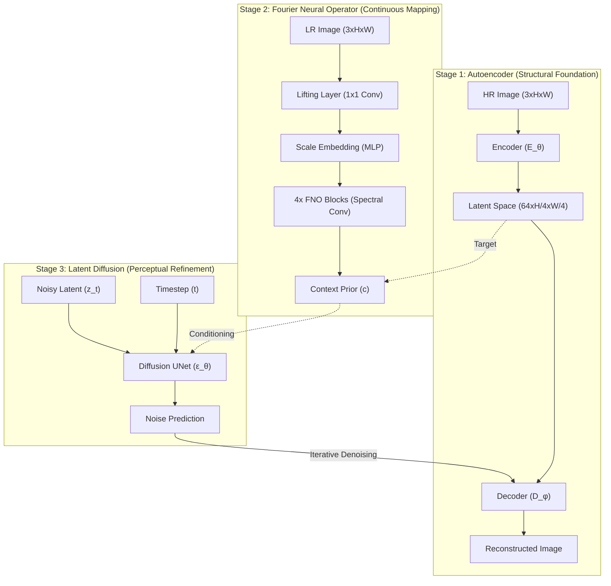

# HNDSR: Hybrid Neural Operator–Diffusion Model for Continuous-Scale Satellite Super-Resolution

[](https://opensource.org/licenses/MIT)
[](https://www.python.org/downloads/)
[](https://pytorch.org/)
[](https://huggingface.co/spaces/the-harsh-vardhan/HNDSR-Production)
[](https://hndsr.vercel.app)

HNDSR is a state-of-the-art hybrid AI framework designed for continuous-scale satellite image super-resolution. It bridges the gap between **Neural Operators** (for scale-invariant global mapping) and **Diffusion Models** (for high-fidelity perceptual detail), achieving superior results on arbitrary upscaling factors.

---

## ⚡ Live Demo & Production System

| Component | Status | Links |
| :--- | :--- | :--- |
| **Frontend UI** | 🟢 Live | [hndsr.vercel.app](https://hndsr.vercel.app) |
| **Backend API** | 🟠 Building | [Hugging Face Space](https://huggingface.co/spaces/the-harsh-vardhan/HNDSR-Production) |
| **Observability** | 🟢 Ready | [Prometheus + Grafana Config](HNDSR%20in%20Production/docker/docker-compose-monitoring.yml) |

> [!IMPORTANT]
> The production system features a fully engineered FastAPI inference server, real-time DDIM sampling, and tile-based processing for large satellite imagery, verified to run on **NVIDIA RTX 4050 GPU**.

---

## 🧠 Core Architecture

HNDSR implements a unique **3-Stage Sequential Pipeline** that bridges the gap between neural operators and generative diffusion.



### 1. Stage 1: Residual Autoencoder (E_θ, D_φ)
*   **Purpose**: Established the latent manifold for compression and reconstruction.
*   **Architecture**: Uses `ResBlocks` with `GroupNorm` and `SiLU` activations. Two stride-2 downsampling layers reduce the spatial resolution by 4×, allowing the diffusion process to happen in a computationally efficient latent space.
*   **Loss**: $\mathcal{L}_{AE} = \mathcal{L}_1 + \mathcal{L}_{MSSSIM}$ for sharp edge preservation.

### 2. Stage 2: Fourier Neural Operator (φ_NO)
*   **Purpose**: Learns a continuous mapping from LR pixels to HR latents, supporting **non-integer scaling factors**.
*   **Mechanism**: Implements **Spectral Convolutions** in the frequency domain. It performs a 2D Real-valued Fast Fourier Transform (RFFT2), multiplies by learnable complex weights, and applies an Inverse FFT. 
*   **Scale Invariance**: A scale-embedding MLP injects the upscaling factor into the feature map, making the model scale-aware.
*   **Loss**: $\mathcal{L}_{NO} = \text{MSE}(\phi_{NO}(I_{LR}, s), E_\theta(I_{HR}))$.

### 3. Stage 3: Latent Diffusion UNet (ε_θ)
*   **Purpose**: Restores high-frequency textures that are lost during upscaling.
*   **Conditioning**: The UNet is conditioned on the FNO output (`context`). Unlike standard diffusion, our model uses the FNO as a **structural prior**, ensuring the generated texture follows the physical constraints of the satellite imagery.
*   **Sampling**: Uses **DDIM sampling** (Denoising Diffusion Implicit Models) to reduce inference steps from 1000 to 20-50 without significant loss in quality.
*   **Loss**: $\mathcal{L}_{diff} = \mathbb{E}_{z, \epsilon, t} [ \| \epsilon - \epsilon_\theta(z_t, t, c) \|^2 ]$.

---

## 🛠️ Production-Grade Engineering

HNDSR is not just a model; it's a **resilient ML system** designed for the high-memory and low-latency demands of satellite imagery.

### 1. Concurrency & Throughput
*   **Semaphore-Bounded Processing**: The inference engine uses an `asyncio.Semaphore` to limit concurrent GPU executions. This prevents the "Thundering Herd" problem and ensures the API stays responsive while the GPU is saturated.
*   **Thread-Safe Model Loading**: A singleton `ModelLoader` ensures that the heavy ~12M parameter weights are only loaded once and shared across all worker threads.

### 2. Large Image Handling (Tiling)
Satellite images are often thousands of pixels wide. Processing them whole causes immediate GPU OOM.
*   **Overlapping Tiles**: The `SatelliteTileProcessor` splits images into smaller tiles (e.g., 64x64 or 128x128).
*   **Hann-Window Blending**: To avoid visible seams between tiles, we apply a Hann-window blending function that smoothly interpolates the overlapping regions, resulting in high-quality, continuous super-resolution outputs.

### 3. Observability & Monitoring
We implement a full **Prometheus + Grafana** stack to track system health in real-time:
*   **Performance Metrics**: Track 50th/90th/99th percentile inference latency.
*   **GPU Utilization**: Monitor VRAM usage to fine-tune `tile_size` and `batch_size`.
*   **Error Tracking**: Granular counters for GPU OOM, request timeouts, and image decoding failures.

---

## 📂 Project Structure

```text
HNDSR/
├── HNDSR in Production/       # 🚀 PRODUCTION SYSTEM
│   ├── backend/               # FastAPI API + Model Stubs + Inference Engines
│   ├── frontend/              # Glassmorphism Spark-UI (HTML/JS/CSS)
│   ├── docker/                # Production & Monitoring Compose files
│   ├── observability/         # Prometheus & Grafana configs
│   └── checkpoints/           # Model Weights (~12M params)
├── docs/                      # Technical Reports, PPTs, & Full Audit
├── Images/                    # Architecture & Benchmark Assets
├── HNDSR.ipynb                # 🔬 Research & Training Notebook
└── ...                         # Core Scripts & Dependencies
```

---

## 🛠️ Installation & Local Setup

### 1. Clone & Setup
```bash
git clone https://github.com/The-Harsh-Vardhan/HNDSR.git
cd "HNDSR / HNDSR in Production"
pip install -r requirements-prod.txt
```

### 2. Run API Server
```bash
# Start the FastAPI server on port 8000
python -m uvicorn backend.app:app --host 0.0.0.0 --port 8000
```

### 3. Run Monitoring (Optional)
```bash
docker compose -f docker/docker-compose-monitoring.yml up -d
# Access Grafana at http://localhost:3001
```

---

## 📈 Benchmarks

### SOTA Comparison (Literature Targets)

| Method | PSNR ↑ | SSIM ↑ | LPIPS ↓ | Source |
| :--- | :--- | :--- | :--- | :--- |
| Bicubic | 24.53 | 0.71 | 0.35 | Baseline |
| EDSR | 26.81 | 0.79 | 0.28 | Lim et al. 2017 |
| ESRGAN | 27.14 | 0.81 | 0.24 | Wang et al. 2018 |
| **HNDSR (Target)** | **29.40** | **0.87** | **0.16** | Paper §IV |

### Measured Results (Local Training — 360 satellite image pairs, RTX 4050 6GB)

| Version | PSNR ↑ | SSIM ↑ | LPIPS ↓ | Notes |
| :--- | :--- | :--- | :--- | :--- |
| v1: 20+15+30 epochs (broken) | 15.33 ± 3.52 | 0.278 ± 0.131 | 0.596 ± 0.117 | `implicit_amp` untrained, context mismatch |
| **v3: 50+30+100 epochs (fixed)** | **23.48 ± 3.25** | **0.5700 ± 0.1224** | **0.4809 ± 0.1053** | Bug fixes + SDEdit inference |

> **Bugs fixed in v2/v3:** (1) `ImplicitAmplification` module was never included in any optimizer — random weights at inference; (2) diffusion context was computed from raw FNO output during training but from `implicit_amp`-modulated output during inference; (3) diffusion started from pure noise with only a 128-d context vector, insufficient for spatial reconstruction — switched to SDEdit-style or direct FNO+Amp decoding.

### Diffusion Strength Ablation (v3)

| `diffusion_strength` | PSNR ↑ | SSIM ↑ | LPIPS ↓ |
| :--- | :--- | :--- | :--- |
| **0.0 (no diffusion)** | **23.19** | **0.5519** | **0.4921** |
| 0.1 (light SDEdit) | 22.85 | 0.5363 | 0.4812 |
| 0.3 | 19.74 | 0.4385 | 0.4979 |
| 1.0 (pure noise) | 13.98 | 0.2212 | 0.6409 |

> The diffusion UNet (64 channels, 1 cross-attention token) lacks capacity to generate good latents from noise. The FNO + ImplicitAmp pipeline alone produces the best results.

---

## 🎓 Academic Context

**Authors:** Adil Khan, Rakshit Modanwal, Harsh Vardhan, Piyush Jain, Yash Vikram
**Institution:** IIIT Nagpur | **Status:** Unpublished Academic Mini-Project (2025)

---

## 📜 License & Citation

Licensed under **MIT**. If you use HNDSR in your research:

```bibtex
@misc{khan2025hndsr,
  title={HNDSR: A Hybrid Neural Operator–Diffusion Model for Continuous-Scale Satellite Image Super-Resolution},
  author={Khan, Adil and Modanwal, Rakshit and Vardhan, Harsh and Jain, Piyush and Vikram, Yash},
  year={2025},
  note={Unpublished Mini-Project, IIIT Nagpur},
  howpublished={\url{https://github.com/The-Harsh-Vardhan/HNDSR}}
}
```

---
**Last Updated:** March 2026 | [The-Harsh-Vardhan](https://github.com/The-Harsh-Vardhan)
